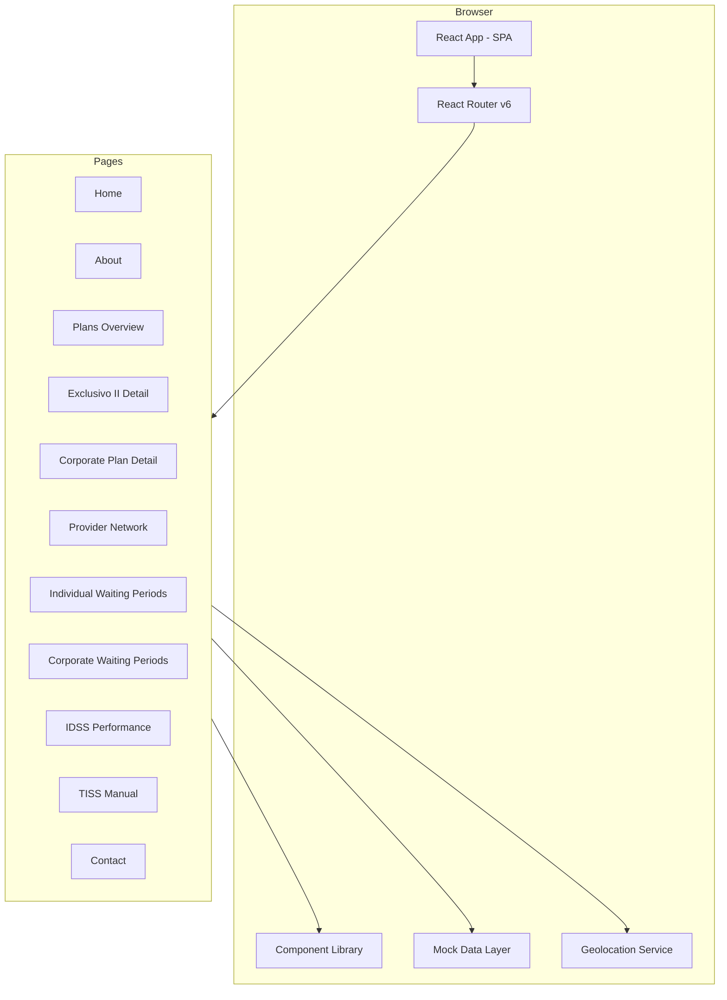
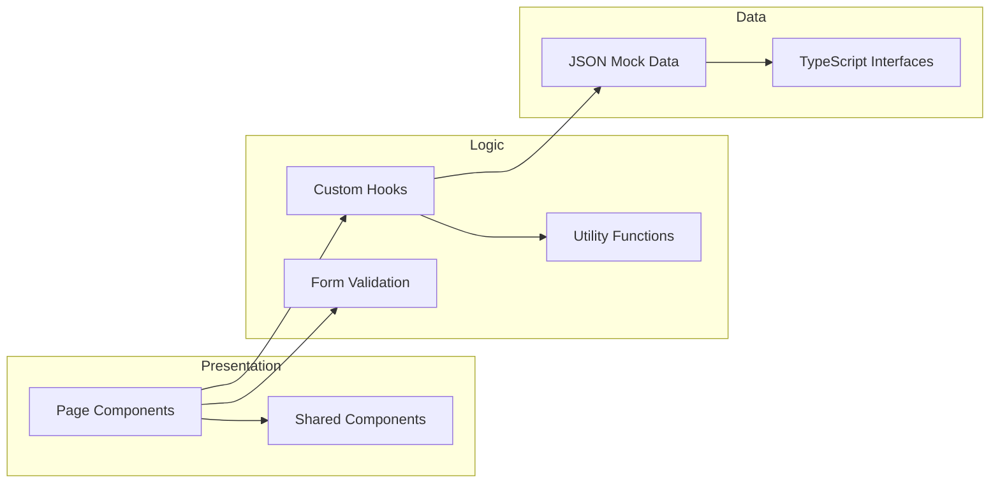

# Design Document: Amacor Website

## Overview

The Amacor Planos de Saúde website is a single-page application (SPA) built with React 18, TypeScript 5, and Tailwind CSS 3. It serves as the digital presence for a health insurance operator targeting users aged 50+, requiring exceptional accessibility, large interactive elements, and clear navigation.

The application consists of 11 pages connected via client-side routing (React Router v6), a set of reusable UI components, and a mock data layer structured for future API integration. The most complex feature is the Provider Network page (Rede Credenciada), which combines geolocation, multi-criteria filtering, sorting, pagination, and multiple view modes (list, map, combined).

### Key Design Decisions

1. **Vite as build tool** — Fast development experience, native TypeScript/React support, optimized production builds.
2. **React Router v6** — Industry-standard client-side routing with nested layouts.
3. **Tailwind CSS with custom theme** — Utility-first styling with brand colors, accessibility-focused spacing/sizing tokens, and responsive breakpoints baked into the config.
4. **Mock data in JSON files** — Clean separation between data and UI; JSON files can be swapped for API calls with minimal refactoring.
5. **Component-driven architecture** — Reusable, typed components with props interfaces; no page-specific hardcoded content in shared components.
6. **Geolocation with graceful degradation** — Browser Geolocation API with fallback to CEP/city search when permission is denied or unavailable.

## Architecture

### High-Level Architecture



### Application Layers



### Project Structure

```
src/
├── components/          # Reusable UI components
│   ├── Header/
│   │   ├── Header.tsx
│   │   └── MobileMenu.tsx
│   ├── Footer/
│   │   └── Footer.tsx
│   ├── WhatsAppButton/
│   │   └── WhatsAppButton.tsx
│   ├── HeroSection/
│   │   └── HeroSection.tsx
│   ├── PlanCard/
│   │   └── PlanCard.tsx
│   ├── InfoCard/
│   │   └── InfoCard.tsx
│   ├── ProviderCard/
│   │   └── ProviderCard.tsx
│   ├── SearchFilters/
│   │   └── SearchFilters.tsx
│   ├── Accordion/
│   │   └── Accordion.tsx
│   ├── ContactForm/
│   │   └── ContactForm.tsx
│   └── CTASection/
│       └── CTASection.tsx
├── pages/               # Page-level components
│   ├── Home.tsx
│   ├── About.tsx
│   ├── Plans.tsx
│   ├── PlanExclusivoII.tsx
│   ├── PlanCorporate.tsx
│   ├── ProviderNetwork.tsx
│   ├── WaitingPeriodsIndividual.tsx
│   ├── WaitingPeriodsCorporate.tsx
│   ├── IDSS.tsx
│   ├── TISSManual.tsx
│   └── Contact.tsx
├── hooks/               # Custom React hooks
│   ├── useGeolocation.ts
│   ├── useProviderSearch.ts
│   ├── useFormValidation.ts
│   └── usePagination.ts
├── data/                # Mock data JSON files
│   ├── providers.json
│   ├── plans.json
│   ├── waitingPeriodsIndividual.json
│   ├── waitingPeriodsCorporate.json
│   └── idssData.json
├── types/               # TypeScript type definitions
│   ├── provider.ts
│   ├── plan.ts
│   ├── waitingPeriod.ts
│   ├── idss.ts
│   └── forms.ts
├── utils/               # Utility functions
│   ├── validation.ts
│   ├── geolocation.ts
│   ├── distance.ts
│   ├── formatters.ts
│   └── filters.ts
├── App.tsx              # Root component with router
├── main.tsx             # Entry point
└── index.css            # Tailwind directives + global styles
```

## Components and Interfaces

### Layout Components

#### Header

```typescript
interface HeaderProps {
  currentPath: string;
}
```

Fixed-position navigation bar. On desktop (>1024px), displays horizontal nav links. On mobile (<768px), collapses into a hamburger menu with a slide-out panel. Active link is visually distinguished via brand color underline. All nav items use minimum 16px font size and 48x48px tap targets on mobile.

#### Footer

```typescript
interface FooterProps {
  // No required props — content is static regulatory/contact info
}
```

Full-width footer with regulatory information (ANS registry number), contact details, secondary navigation links, and copyright. Consistent across all pages.

#### WhatsAppButton

```typescript
interface WhatsAppButtonProps {
  phoneNumber: string;
  message?: string;
}
```

Floating action button, fixed bottom-right, 56x56px minimum. Opens WhatsApp Web/app link in new tab. Green background color (reserved exclusively for WhatsApp/confirmation per brand guidelines).

### Content Components

#### HeroSection

```typescript
interface HeroSectionProps {
  headline: string;
  subtitle: string;
  ctaText: string;
  ctaLink: string;
  backgroundImage?: string;
}
```

Full-width banner with headline, subtitle (≤150 chars), and CTA button. Responsive: stacks vertically on mobile, side-by-side on desktop.

#### PlanCard

```typescript
interface PlanCardProps {
  name: string;
  description: string;
  benefits: string[];
  ctaText: string;
  ctaLink: string;
  highlighted?: boolean;
}
```

Card component for plan summaries. Displays name, description (≤150 chars), 3-5 benefit items as a list, and CTA button. Grid layout on desktop, stacked on mobile.

#### InfoCard

```typescript
interface InfoCardProps {
  title: string;
  description: string;
  icon?: React.ReactNode;
  link?: string;
  linkText?: string;
}
```

Generic card for displaying information blocks (values, highlights, benefits). Rounded corners, soft shadow, consistent padding.

#### ProviderCard

```typescript
interface ProviderCardProps {
  provider: Provider;
  userLocation?: { lat: number; lng: number } | null;
  onShowOnMap?: (providerId: string) => void;
}
```

Displays full provider information: name, type badge, specialties, address, phone (tap-to-call), WhatsApp (tap-to-chat), operating hours, accepted plans, and distance in km. Action buttons for call, WhatsApp, directions (opens maps app), and show on map.

#### SearchFilters

```typescript
interface SearchFiltersProps {
  specialties: string[];
  plans: string[];
  providerTypes: string[];
  onFiltersChange: (filters: ProviderFilters) => void;
  onGeolocationRequest: () => void;
  isGeolocating?: boolean;
  geolocationError?: string | null;
}
```

Filter panel for Provider Network page. Contains: geolocation button, CEP input (8-digit validation), city/neighborhood text input, specialty dropdown, plan dropdown, provider type dropdown. Full-width on mobile, horizontal layout on desktop.

#### Accordion

```typescript
interface AccordionProps {
  items: AccordionItem[];
  allowMultiple?: boolean;
}

interface AccordionItem {
  id: string;
  title: string;
  content: React.ReactNode;
}
```

Collapsible content sections. Default behavior: single-open (clicking one closes others). Optional `allowMultiple` for multi-open mode. Used for waiting period pages.

#### ContactForm

```typescript
interface ContactFormProps {
  fields: FormFieldConfig[];
  onSubmit: (data: Record<string, string>) => Promise<void>;
  submitButtonText?: string;
  successMessage?: string;
}

interface FormFieldConfig {
  name: string;
  label: string;
  type: 'text' | 'email' | 'tel' | 'number' | 'textarea';
  required: boolean;
  maxLength?: number;
  min?: number;
  max?: number;
  placeholder?: string;
  validation?: ValidationRule[];
}
```

Reusable form component. Handles validation, error display (inline red text), success state (green confirmation), and error state (submission failure with data preservation). All fields render at full width on mobile with 48px minimum height.

#### CTASection

```typescript
interface CTASectionProps {
  title: string;
  description?: string;
  primaryAction: {
    text: string;
    link: string;
    variant?: 'whatsapp' | 'phone' | 'default';
  };
  secondaryAction?: {
    text: string;
    link: string;
    variant?: 'whatsapp' | 'phone' | 'default';
  };
}
```

Call-to-action block with title, optional description, and 1-2 action buttons. Button variants control color (green for WhatsApp, blue for default, etc.). Minimum 48x48px touch targets.

### Custom Hooks

#### useGeolocation

```typescript
interface GeolocationState {
  position: { lat: number; lng: number } | null;
  error: string | null;
  isLoading: boolean;
  isPermissionDenied: boolean;
}

function useGeolocation(): GeolocationState & { requestLocation: () => void };
```

Wraps the browser Geolocation API. Handles permission states, errors, and loading. Returns coordinates or error state for graceful degradation.

#### useProviderSearch

```typescript
interface UseProviderSearchOptions {
  providers: Provider[];
  userLocation?: { lat: number; lng: number } | null;
}

interface UseProviderSearchReturn {
  results: Provider[];
  totalResults: number;
  filters: ProviderFilters;
  setFilters: (filters: Partial<ProviderFilters>) => void;
  sortBy: SortOption;
  setSortBy: (sort: SortOption) => void;
  currentPage: number;
  setCurrentPage: (page: number) => void;
  totalPages: number;
}

function useProviderSearch(options: UseProviderSearchOptions): UseProviderSearchReturn;
```

Encapsulates all provider filtering, sorting, and pagination logic. Computes distance from user location, applies multi-criteria filters, sorts results, and paginates (20 per page).

#### useFormValidation

```typescript
interface UseFormValidationReturn<T> {
  values: T;
  errors: Partial<Record<keyof T, string>>;
  touched: Partial<Record<keyof T, boolean>>;
  handleChange: (field: keyof T, value: string) => void;
  handleBlur: (field: keyof T) => void;
  handleSubmit: () => boolean;
  reset: () => void;
  isValid: boolean;
}

function useFormValidation<T>(config: FormFieldConfig[]): UseFormValidationReturn<T>;
```

Generic form validation hook. Validates on blur and submit. Returns field-level errors, touched state, and overall validity.

#### usePagination

```typescript
interface UsePaginationReturn {
  currentPage: number;
  totalPages: number;
  goToPage: (page: number) => void;
  nextPage: () => void;
  prevPage: () => void;
  startIndex: number;
  endIndex: number;
}

function usePagination(totalItems: number, itemsPerPage: number): UsePaginationReturn;
```

Generic pagination logic. Used by Provider Network page (20 items per page).

## Data Models

### Provider

```typescript
interface Provider {
  id: string;
  name: string;
  type: ProviderType;
  specialties: Specialty[];
  address: {
    street: string;
    number: string;
    complement?: string;
    neighborhood: string;
    city: string;
    state: string;
    cep: string;
  };
  coordinates: {
    lat: number;
    lng: number;
  };
  phone: string;
  whatsapp?: string;
  operatingHours: {
    weekdays: string;
    saturday?: string;
    sunday?: string;
  };
  acceptedPlans: PlanType[];
}

type ProviderType = 'Hospital' | 'Clínica' | 'Laboratório' | 'Consultório' | 'Pronto-Socorro';

type Specialty =
  | 'Clínica médica'
  | 'Cardiologia'
  | 'Dermatologia'
  | 'Ginecologia'
  | 'Pediatria'
  | 'Ortopedia'
  | 'Oftalmologia'
  | 'Laboratório'
  | 'Fisioterapia'
  | 'Psicologia'
  | 'Exames'
  | 'Urgência'
  | 'Telemedicina';

type PlanType = 'Exclusivo I' | 'Exclusivo II' | 'Empresarial';
```

### Plan

```typescript
interface Plan {
  id: string;
  name: string;
  slug: string;
  description: string;
  benefits: string[];
  type: 'individual' | 'corporate';
  highlighted?: boolean;
}
```

### Waiting Period

```typescript
interface WaitingPeriod {
  id: string;
  procedure: string;
  durationDays: number;
  category?: string;
}
```

### IDSS Data

```typescript
interface IDSSYearData {
  year: number;
  indicators: {
    IDSS: number;
    IDQS: number;
    IDGA: number;
    IDSM: number;
    IDGR: number;
  };
}
```

### Form Types

```typescript
interface ContactFormData {
  name: string;
  phone: string;
  email: string;
  subject?: string;
  message?: string;
}

interface ProposalFormData {
  companyName: string;
  contactName: string;
  phone: string;
  email: string;
  numberOfEmployees: number;
  message?: string;
}

interface ExclusivoIIFormData {
  name: string;
  phone: string;
  email: string;
  message?: string;
}
```

### Filter Types

```typescript
interface ProviderFilters {
  searchQuery?: string;
  cep?: string;
  city?: string;
  neighborhood?: string;
  specialty?: Specialty | null;
  plan?: PlanType | null;
  providerType?: ProviderType | null;
  userLocation?: { lat: number; lng: number } | null;
  radiusKm?: number;
}

type SortOption = 'proximity' | 'alphabetical' | 'specialty' | 'city' | 'neighborhood';

type ViewMode = 'list' | 'map' | 'combined';
```

### Validation Types

```typescript
interface ValidationRule {
  type: 'required' | 'email' | 'phone' | 'minLength' | 'maxLength' | 'min' | 'max' | 'pattern' | 'cep';
  value?: number | string | RegExp;
  message: string;
}

interface ValidationResult {
  isValid: boolean;
  errors: Record<string, string>;
}
```

## Correctness Properties

*A property is a characteristic or behavior that should hold true across all valid executions of a system — essentially, a formal statement about what the system should do. Properties serve as the bridge between human-readable specifications and machine-verifiable correctness guarantees.*

### Property 1: Form validation correctness

*For any* form field configuration and any input value, the validation function SHALL return `isValid: true` if and only if all required fields are non-empty and all field values satisfy their declared constraints (email format, phone digit count, max length, numeric range), and SHALL return specific error messages for each field that fails validation.

**Validates: Requirements 5.2, 5.4, 6.2, 6.4, 12.1, 12.5**

### Property 2: CEP format validation

*For any* string input, the CEP validation function SHALL accept the input if and only if it consists of exactly 8 numeric digits (after removing formatting characters), and SHALL reject all other inputs with an appropriate error message.

**Validates: Requirements 7.18**

### Property 3: Distance-based provider filtering

*For any* center point (lat, lng) and set of providers with coordinates, the radius filter function SHALL return only providers whose Haversine distance from the center point is less than or equal to the specified radius (10 km), and SHALL exclude all providers beyond that radius.

**Validates: Requirements 7.3**

### Property 4: Provider sorting invariant

*For any* non-empty list of providers and any sort option (alphabetical, proximity, specialty, city, neighborhood), the sort function SHALL return a list where each adjacent pair of elements satisfies the ordering relation for the selected sort criterion (e.g., for alphabetical: name[i] ≤ name[i+1]).

**Validates: Requirements 7.8**

### Property 5: Pagination calculation correctness

*For any* total item count ≥ 0 and page size of 20, the pagination function SHALL compute `totalPages = Math.ceil(totalItems / 20)`, and for any valid page number p (1 ≤ p ≤ totalPages), SHALL compute `startIndex = (p - 1) * 20` and `endIndex = Math.min(p * 20, totalItems)`.

**Validates: Requirements 7.19**

### Property 6: Case-insensitive substring filter

*For any* list of items with text labels and any search string, the filter function SHALL return exactly those items whose label contains the search string as a case-insensitive substring, and SHALL exclude all items that do not contain it.

**Validates: Requirements 8.3, 9.3**

### Property 7: PlanCard renders all required fields

*For any* valid Plan object, the PlanCard component SHALL render the plan name, description, all benefit items, and a CTA button in its output.

**Validates: Requirements 4.2**

### Property 8: ProviderCard renders all required fields

*For any* valid Provider object, the ProviderCard component SHALL render the provider name, type, specialties, full address, phone number, operating hours, and accepted plans in its output.

**Validates: Requirements 7.9**

### Property 9: IDSS indicator formatting

*For any* valid IDSSYearData object, the rendering function SHALL display all 5 indicator acronyms (IDSS, IDQS, IDGA, IDSM, IDGR) each with its numeric value formatted to exactly 4 decimal places.

**Validates: Requirements 10.3**

## Error Handling

### Form Submission Errors

| Scenario | Behavior |
|----------|----------|
| Missing required fields | Inline red error text next to each empty required field; form data preserved |
| Invalid field format (email, phone, CEP) | Inline red error text with specific guidance; form data preserved |
| Network/server error on submit | Global error banner below form; all entered data preserved; user can retry |
| Successful submission | Green confirmation message; all fields cleared |

### Geolocation Errors

| Scenario | Behavior |
|----------|----------|
| Permission denied | Message: "Localização indisponível. Busque por CEP ou cidade." |
| Geolocation API unavailable | Same fallback message; CEP/city inputs highlighted |
| Timeout or position unavailable | Same fallback message with retry option |

### Provider Network Edge Cases

| Scenario | Behavior |
|----------|----------|
| No providers match filters | Empty state: "Nenhum prestador encontrado. Tente ampliar os filtros." |
| Invalid CEP format | Inline validation: "Informe um CEP válido com 8 dígitos." |
| Zero results for CEP radius | Same empty state message with suggestion to increase radius or try different CEP |

### Download Errors (TISS)

| Scenario | Behavior |
|----------|----------|
| File unavailable | Error message: "Arquivo indisponível. Tente novamente mais tarde." |
| Network failure during download | Same error message with retry suggestion |

### General Error Principles

1. **Never lose user data** — form inputs are always preserved on error.
2. **Specific guidance** — error messages tell the user what to fix, not just that something is wrong.
3. **Graceful degradation** — if a feature (geolocation, map) fails, alternative paths are offered.
4. **No silent failures** — every error state has visible user feedback.
5. **Portuguese language** — all user-facing error messages in Brazilian Portuguese.

## Testing Strategy

### Testing Framework

- **Unit/Component tests**: Vitest + React Testing Library
- **Property-based tests**: fast-check (with Vitest as runner)
- **Accessibility audits**: axe-core (via @axe-core/react or jest-axe)
- **End-to-end (optional future)**: Playwright

### Unit Tests

Unit tests cover specific examples, edge cases, and integration points:

- **Component rendering**: Each reusable component renders correctly with required props
- **Navigation**: React Router routes resolve to correct page components
- **Responsive behavior**: Components adapt at breakpoint boundaries
- **Interactions**: Button clicks, form submissions, accordion expand/collapse
- **Error states**: Empty states, failed submissions, denied permissions
- **Accessibility**: Focus management, ARIA attributes, keyboard navigation

### Property-Based Tests

Property-based tests validate universal correctness properties using fast-check:

- **Minimum 100 iterations** per property test
- **Each test references its design property** via tag comment
- **Tag format**: `Feature: amacor-website, Property {number}: {property_text}`

Properties tested:
1. Form validation engine (all form types share the same validation utility)
2. CEP format validation
3. Haversine distance calculation and radius filtering
4. Provider list sorting (all 5 sort options)
5. Pagination arithmetic
6. Case-insensitive substring filtering (accordion search)
7. PlanCard rendering completeness
8. ProviderCard rendering completeness
9. IDSS indicator formatting

### Test Organization

```
src/
├── __tests__/
│   ├── properties/           # Property-based tests
│   │   ├── validation.property.test.ts
│   │   ├── cep.property.test.ts
│   │   ├── distance.property.test.ts
│   │   ├── sorting.property.test.ts
│   │   ├── pagination.property.test.ts
│   │   ├── filter.property.test.ts
│   │   ├── planCard.property.test.tsx
│   │   ├── providerCard.property.test.tsx
│   │   └── idss.property.test.tsx
│   ├── components/           # Component unit tests
│   │   ├── Header.test.tsx
│   │   ├── Footer.test.tsx
│   │   ├── Accordion.test.tsx
│   │   ├── ContactForm.test.tsx
│   │   └── ...
│   └── pages/                # Page-level integration tests
│       ├── Home.test.tsx
│       ├── ProviderNetwork.test.tsx
│       └── ...
```

### Accessibility Testing

- Run axe-core on each page component to catch contrast, ARIA, and structure issues
- Verify focus indicators on all interactive elements
- Test keyboard navigation flow through forms and accordions
- Verify screen reader compatibility for dynamic content (accordion, filter results)

