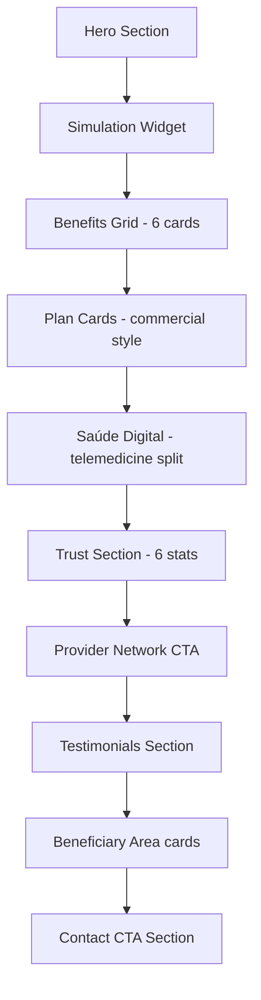

# Design Document: Amacor Website Redesign

## Overview

This design describes the technical architecture for the Amacor Planos de Saúde website redesign — a React + TypeScript + Tailwind CSS application targeting conversion optimization, institutional trust, and self-service for beneficiaries. The redesign builds on the existing infrastructure (React Router, custom hooks, utilities, types, contexts) while introducing new components (SimulationWidget, BenefitsGrid, TrustSection, TestimonialsSection), new pages (Telemedicine, Institutional, Exclusivo I detail, Amacor Mais com Franquia detail), and enhanced versions of existing components (PlanCard with pricing, WhatsAppButton/CTA with contextual messages).

The primary audience is 50+ years old, requiring large touch targets (min 48×48px), high contrast (4.5:1+), generous whitespace, and clear hierarchy. The visual identity uses a blue/green health palette with rounded cards, soft shadows, human photography, and medical icons.

### Key Design Decisions

1. **Extend, don't replace**: Existing hooks (`useProviderSearch`, `useFormValidation`, `useGeolocation`, `usePagination`), utilities, and types remain in place. New features augment the current architecture.
2. **Mock-first data layer**: All new data (simulation pricing, testimonials, telemedicine info) lives in `src/data/` JSON files with typed interfaces, ready for API replacement via `src/services/api.ts`.
3. **Component-driven**: Each visual block maps to a reusable component with a typed props interface. Pages compose components without hardcoded content.
4. **Contextual WhatsApp**: A `WhatsAppCTA` component (distinct from the floating `WhatsAppButton`) accepts page context and plan info to generate pre-filled messages.

## Architecture

### System Architecture Diagram

```mermaid
graph TB
    subgraph "Browser"
        App[App.tsx - BrowserRouter]
        Auth[AuthContext]
        AdminAuth[AdminAuthContext]
    end

    subgraph "Pages Layer"
        Home[Home Page]
        Plans[Plans Page]
        PlanDetail[Plan Detail Pages]
        Telemedicine[Telemedicine Page]
        Institutional[Institutional Page]
        ProviderNetwork[Provider Network Page]
        BeneficiaryArea[Beneficiary Area Page]
        WaitingPeriods[Waiting Periods Pages]
        IDSS[IDSS Page]
        Contact[Contact Page]
        TISS[TISS Manual Page]
    end

    subgraph "Component Library"
        Header[Header]
        Footer[Footer]
        HeroSection[HeroSection]
        SimWidget[SimulationWidget]
        BenefitsGrid[BenefitsGrid]
        PlanCard[PlanCard]
        TrustSection[TrustSection]
        Testimonials[TestimonialsSection]
        WhatsAppBtn[WhatsAppButton]
        WhatsAppCTA[WhatsAppCTA]
        CTASection[CTASection]
        ProviderCard[ProviderCard]
        SearchFilters[SearchFilters]
        Accordion[Accordion]
        ContactForm[ContactForm]
        ProviderMap[ProviderMap]
    end

    subgraph "Data Layer"
        PlansData[plans.json]
        ProvidersData[providers.json]
        SimulationData[simulationPricing.json]
        TestimonialsData[testimonials.json]
        TelemedicineData[telemedicine.json]
        InstitutionalData[institutional.json]
        BenefitsData[benefits.json]
    end

    subgraph "Hooks & Utils"
        useProviderSearch[useProviderSearch]
        useFormValidation[useFormValidation]
        useGeolocation[useGeolocation]
        usePagination[usePagination]
        useSimulation[useSimulation]
        Validation[validation.ts]
        Filters[filters.ts]
        Distance[distance.ts]
        Formatters[formatters.ts]
    end

    App --> Auth
    App --> AdminAuth
    App --> Home
    App --> Plans
    App --> PlanDetail
    App --> Telemedicine
    App --> Institutional
    App --> ProviderNetwork
    App --> BeneficiaryArea

    Home --> HeroSection
    Home --> SimWidget
    Home --> BenefitsGrid
    Home --> PlanCard
    Home --> TrustSection
    Home --> Testimonials
    Home --> CTASection
    Home --> WhatsAppCTA

    Plans --> PlanCard
    Plans --> SimWidget

    PlanDetail --> ContactForm
    PlanDetail --> WhatsAppCTA

    ProviderNetwork --> SearchFilters
    ProviderNetwork --> ProviderCard
    ProviderNetwork --> ProviderMap
    ProviderNetwork --> useProviderSearch

    SimWidget --> useSimulation
    useSimulation --> SimulationData
    useProviderSearch --> Filters
    useProviderSearch --> Distance
    ContactForm --> useFormValidation
    useFormValidation --> Validation
```



### Routing Updates

New routes to add to `App.tsx`:

| Route | Page Component | Description |
|-------|---------------|-------------|
| `/planos/exclusivo-i` | `PlanExclusivoI` | Exclusivo I plan detail |
| `/planos/mais-com-franquia` | `PlanMaisComFranquia` | Amacor Mais com Franquia detail |
| `/telemedicina` | `Telemedicine` | Telemedicine explanation page |
| `/institucional` | `Institutional` | History, ANS, IDSS, values |

Existing routes remain unchanged. The `/sobre` (About) route will be redirected to `/institucional` or deprecated in favor of the new Institutional page.

### Navigation Structure Update

The Header navigation items change to:

```
Início | Planos ▾ | Telemedicina | Rede Credenciada | Área do Beneficiário | Institucional | Contato
              └── Exclusivo I
              └── Exclusivo II
              └── Mais com Franquia
              └── Empresarial
```

Only one level of dropdown (Plans submenu). No nested menus beyond that.

## Components and Interfaces

### New Components

#### 1. SimulationWidget

Allows users to select age range and number of dependents to estimate monthly plan pricing.

```typescript
interface SimulationWidgetProps {
  onSimulationComplete?: (result: SimulationResult) => void;
  className?: string;
}

interface SimulationResult {
  ageRange: AgeRange;
  dependents: number;
  plans: SimulatedPlan[];
}

interface SimulatedPlan {
  planId: string;
  planName: string;
  estimatedPrice: number;
  priceFormatted: string;
}

type AgeRange = '0-18' | '19-23' | '24-28' | '29-33' | '34-38' | '39-43' | '44-48' | '49-53' | '54-58' | '59+';
```

**Behavior**: On selection of age range + dependents, calculates estimated price from a pricing matrix in `simulationPricing.json`. Displays results with a WhatsApp CTA pre-filled with the simulated plan details.

#### 2. BenefitsGrid

Displays 6 icon-based rounded cards with benefit highlights.

```typescript
interface BenefitsGridProps {
  benefits: BenefitItem[];
  className?: string;
}

interface BenefitItem {
  id: string;
  icon: string; // Icon component name or SVG path
  title: string;
  description: string;
}
```

#### 3. TrustSection

Displays institutional stats and credentials.

```typescript
interface TrustSectionProps {
  title: string;
  stats: TrustStat[];
  className?: string;
}

interface TrustStat {
  id: string;
  value: string;
  label: string;
  icon?: string;
}
```

#### 4. TestimonialsSection

Displays customer testimonials or trust indicators.

```typescript
interface TestimonialsSectionProps {
  title?: string;
  testimonials: Testimonial[];
  className?: string;
}

interface Testimonial {
  id: string;
  name: string;
  location?: string;
  quote: string;
  rating?: number; // 1-5
  avatar?: string;
}
```

#### 5. WhatsAppCTA (Inline)

Distinct from the floating WhatsAppButton. An inline CTA with contextual pre-filled messages.

```typescript
interface WhatsAppCTAProps {
  phoneNumber: string;
  message: string;
  label?: string;        // Button text, defaults to "Contratar pelo WhatsApp"
  variant?: 'primary' | 'secondary' | 'compact';
  className?: string;
}
```

**Message templating**: Each page passes a context-specific message. Example:
- Plans page: `"Olá! Tenho interesse no plano {planName}. Gostaria de mais informações."`
- Simulation result: `"Olá! Simulei o plano {planName} para {dependents} dependente(s), faixa {ageRange}. Preço estimado: {price}. Gostaria de contratar."`
- Generic: `"Olá! Estou no site da Amacor e gostaria de mais informações."`

### Enhanced Existing Components

#### PlanCard (Enhanced)

The existing `PlanCard` needs additional props for pricing and dual CTAs:

```typescript
interface PlanCardProps {
  name: string;
  slug: string;
  tagline: string;         // max 80 chars
  startingPrice: string;   // "A partir de R$ 89,90"
  contractType: string;    // "Individual", "Familiar", "Empresarial"
  benefits: string[];      // 3-5 items
  highlighted?: boolean;
  whatsappNumber: string;
  whatsappMessage?: string;
}
```

Renders two CTAs: "Ver detalhes" (navigates to `/planos/{slug}`) and "Contratar pelo WhatsApp".

#### HeroSection (Enhanced)

The existing `HeroSection` needs support for dual CTAs:

```typescript
interface HeroSectionProps {
  headline: string;
  subtitle: string;
  primaryCTA: {
    text: string;
    link: string;
    variant?: 'button' | 'scroll'; // scroll for anchor on same page
  };
  secondaryCTA?: {
    text: string;
    link: string;
    variant?: 'whatsapp' | 'phone' | 'link';
  };
  backgroundImage?: string;
}
```

#### Header (Enhanced)

Navigation restructured with single-level dropdown for Plans:

```typescript
interface HeaderProps {
  currentPath: string;
}

interface NavItem {
  label: string;
  href: string;
  children?: NavItem[];  // max 1 level deep
}
```

### Hook: useSimulation

New hook encapsulating pricing calculation logic.

```typescript
interface UseSimulationReturn {
  ageRange: AgeRange | null;
  dependents: number;
  setAgeRange: (range: AgeRange) => void;
  setDependents: (count: number) => void;
  results: SimulatedPlan[] | null;
  isCalculating: boolean;
  reset: () => void;
}
```

**Logic**: Reads `simulationPricing.json` pricing matrix. For each plan, looks up base price by age range, multiplies by (1 + dependents × dependent_factor). Returns formatted results. Pure computation, no side effects.

## Data Models

### Simulation Pricing Data (`src/data/simulationPricing.json`)

```typescript
interface SimulationPricingData {
  plans: PlanPricing[];
  dependentFactor: number; // e.g., 0.85 — each dependent adds 85% of base
}

interface PlanPricing {
  planId: string;
  planName: string;
  slug: string;
  priceByAge: Record<AgeRange, number>; // base monthly price per age range
}
```

Example structure:
```json
{
  "dependentFactor": 0.85,
  "plans": [
    {
      "planId": "plan-exclusivo-i",
      "planName": "Exclusivo I",
      "slug": "exclusivo-i",
      "priceByAge": {
        "0-18": 89.90,
        "19-23": 99.90,
        "24-28": 119.90,
        "29-33": 139.90,
        "34-38": 169.90,
        "39-43": 199.90,
        "44-48": 249.90,
        "49-53": 319.90,
        "54-58": 399.90,
        "59+": 499.90
      }
    }
  ]
}
```

### Enhanced Plan Type (`src/types/plan.ts`)

```typescript
export interface Plan {
  id: string;
  name: string;
  slug: string;
  tagline: string;          // NEW: max 80 chars
  description: string;
  startingPrice: number;    // NEW: lowest price across age ranges
  contractType: PlanContractType; // NEW
  benefits: string[];
  detailedBenefits: PlanBenefit[]; // NEW: for detail page
  coverageDetails: string[];       // NEW
  coParticipation?: string;        // NEW
  networkInfo: string;             // NEW
  type: 'individual' | 'corporate';
  highlighted?: boolean;
  includesTelemedicine: boolean;   // NEW
}

export type PlanContractType = 'individual' | 'familiar' | 'empresarial';

export interface PlanBenefit {
  icon: string;
  title: string;
  description: string;
}
```

### Enhanced Provider Type (`src/types/provider.ts`)

Add `'Amacor Mais com Franquia'` to the `PlanType` union:

```typescript
export type PlanType = 'Exclusivo I' | 'Exclusivo II' | 'Amacor Mais com Franquia' | 'Empresarial';
```

### Testimonials Data (`src/data/testimonials.json`)

```typescript
interface Testimonial {
  id: string;
  name: string;
  location: string;
  quote: string;
  rating: number;
  avatar?: string;
}
```

### Benefits Data (`src/data/benefits.json`)

```typescript
interface BenefitItem {
  id: string;
  icon: string;
  title: string;
  description: string;
}
```

Six items: Telemedicina 24h, Atendimento ambulatorial, Consultas e exames, Ambulância e aconselhamento médico, Mais de 2 mil procedimentos, Área do beneficiário e 2ª via de boleto.

### Telemedicine Data (`src/data/telemedicine.json`)

```typescript
interface TelemedicineData {
  hero: {
    headline: string;
    subtitle: string;
  };
  steps: TelemedicineStep[];
  benefits: TelemedicineBenefit[];
  faq: FAQItem[];
  plansWithTelemedicine: string[]; // plan IDs
  platformUrl: string;
}

interface TelemedicineStep {
  number: number;
  title: string;
  description: string;
  icon: string;
}

interface TelemedicineBenefit {
  icon: string;
  title: string;
  description: string;
}

interface FAQItem {
  question: string;
  answer: string;
}
```

### Institutional Data (`src/data/institutional.json`)

```typescript
interface InstitutionalData {
  history: {
    title: string;
    content: string;
    milestones: Milestone[];
  };
  mission: string;
  vision: string;
  values: ValueItem[];
  ans: {
    registryNumber: string;
    status: string;
    verificationUrl: string;
  };
  idssLink: string;
}

interface Milestone {
  year: number;
  description: string;
}

interface ValueItem {
  title: string;
  description: string;
  icon: string;
}
```

### Lead Capture Data Structure

For future CRM integration, form submissions stored in a consistent format:

```typescript
interface LeadCapture {
  id: string;
  timestamp: string;
  source: 'contact_form' | 'plan_form' | 'proposal_form' | 'simulation';
  page: string;        // route where the lead was captured
  planContext?: string; // plan name if applicable
  data: Record<string, string | number>;
}
```

### WhatsApp Message Templates

```typescript
interface WhatsAppMessageConfig {
  pageContext: string;   // e.g., "home", "plans", "plan-detail"
  planName?: string;
  simulationData?: {
    ageRange: string;
    dependents: number;
    estimatedPrice: string;
  };
}

// Utility function
function buildWhatsAppMessage(config: WhatsAppMessageConfig): string;
```

### Page Section Order — Home Page




## Correctness Properties

*A property is a characteristic or behavior that should hold true across all valid executions of a system — essentially, a formal statement about what the system should do. Properties serve as the bridge between human-readable specifications and machine-verifiable correctness guarantees.*

### Property 1: WhatsApp URL Construction

*For any* valid phone number and any contextual message string (including plan name, page origin, simulation data), the `buildWhatsAppUrl` function SHALL produce a URL of the form `https://wa.me/{phoneNumber}?text={encodedMessage}` where the message is correctly URI-encoded and the phone number contains only digits.

**Validates: Requirements 1.4, 2.3, 3.7, 4.3, 14.3, 14.5**

### Property 2: Form Validation Correctness

*For any* form field configuration and any input data, the `validateForm` function SHALL return `isValid: true` with empty errors when all required fields are non-empty and all format rules pass, AND SHALL return `isValid: false` with errors keyed to exactly the invalid fields when any field violates its validation rules. Additionally, *for any* string that does not match the 8-digit numeric CEP pattern, `validateCep` SHALL return false.

**Validates: Requirements 4.4, 4.5, 8.18, 13.5, 13.6**

### Property 3: Simulation Pricing Calculation

*For any* valid age range and any non-negative integer number of dependents, the `calculateSimulationPrice` function SHALL return a price equal to `basePriceForAgeRange + (dependents × basePriceForAgeRange × dependentFactor)` for each plan in the pricing matrix, and the result SHALL always be a positive number formatted to 2 decimal places.

**Validates: Requirements 2.4**

### Property 4: Plan Filtering by Category

*For any* list of plans and any filter category from {Todos, Individual, Familiar, Empresarial}, filtering SHALL return all plans when category is "Todos", and SHALL return only plans whose `contractType` matches the selected category otherwise. The result set SHALL be a subset of the original list, and filtering SHALL not modify the original list.

**Validates: Requirements 3.9**

### Property 5: Provider Distance Filtering

*For any* set of providers with coordinates and any center point (lat, lng) with a radius of 10km, the `filterProviders` function with a radius constraint SHALL include only providers whose Haversine distance from the center is less than or equal to 10km, and SHALL exclude all providers beyond that distance.

**Validates: Requirements 8.3**

### Property 6: Provider Sorting Correctness

*For any* list of providers, sorting by "alphabetical" SHALL produce providers in non-decreasing lexicographic order by name, sorting by "proximity" (given a user location) SHALL produce providers in non-decreasing distance order, and sorting by "city" SHALL produce providers in non-decreasing lexicographic order by city name. The sorted result SHALL contain exactly the same elements as the input (no additions or removals).

**Validates: Requirements 8.8**

### Property 7: Pagination Invariant

*For any* non-negative total result count and a page size of 20, each page SHALL contain at most 20 items, `totalPages` SHALL equal `Math.ceil(totalResults / 20)`, and the sum of items across all pages SHALL equal `totalResults`. For any valid page number `p` (1 ≤ p ≤ totalPages), `startIndex` SHALL equal `(p - 1) * 20` and `endIndex` SHALL equal `min(p * 20, totalResults)`.

**Validates: Requirements 8.19**

### Property 8: Procedure Search Filtering

*For any* search string and any list of procedure names with waiting periods, the case-insensitive substring filter SHALL return exactly those items where `procedureName.toLowerCase().includes(searchString.toLowerCase())`. When the search string is empty, all items SHALL be returned. The filter SHALL not modify the original list.

**Validates: Requirements 9.3, 10.3**

### Property 9: Accordion Mutual Exclusion

*For any* accordion component state and any sequence of item clicks, at most one accordion item SHALL be in the expanded state at any given time. Clicking a collapsed item SHALL expand it and collapse any currently expanded item. Clicking an already-expanded item SHALL collapse it, resulting in zero expanded items.

**Validates: Requirements 9.4, 10.6**

### Property 10: IDSS Data Rendering Completeness

*For any* valid IDSSYearData object containing indicator values, the rendering function SHALL produce output containing all five indicator labels (IDSS, IDQS, IDGA, IDSM, IDGR) each paired with its corresponding numeric value formatted to 4 decimal places.

**Validates: Requirements 11.3**

### Property 11: Navigation Uniqueness and Depth

*For any* valid navigation configuration, no two navigation items SHALL share the same `href` value, and no navigation item SHALL have children that themselves have children (maximum depth of 1 level of nesting).

**Validates: Requirements 1.9**

### Property 12: Design System Color Contrast

*For any* (text color, background color) pair used in the application's design token system, the computed WCAG contrast ratio SHALL be at least 4.5:1 for text below 24px, and at least 3:1 for text at 24px or larger.

**Validates: Requirements 15.3**

### Property 13: Lead Capture Data Integrity

*For any* valid form submission, the resulting LeadCapture object SHALL contain a non-empty `id`, a valid ISO timestamp, a `source` matching one of the allowed values, a `page` matching the current route, and a `data` object containing all submitted field values without data loss or transformation.

**Validates: Requirements 14.4**

## Error Handling

### Form Submission Errors

| Error Scenario | User Feedback | Data Preservation |
|---|---|---|
| Required field empty | Red inline error below field: "{FieldLabel} é obrigatório." | All entered data preserved |
| Invalid email format | Red inline error: "Formato de e-mail inválido." | All entered data preserved |
| Invalid phone format | Red inline error: "Telefone inválido. Use DDD + número." | All entered data preserved |
| Invalid CEP format | Red inline error: "CEP deve conter 8 dígitos numéricos." | All entered data preserved |
| Server/network error | Green area replaced with red banner: "Não foi possível enviar sua mensagem. Tente novamente." | All entered data preserved |
| Successful submission | Green confirmation: "Mensagem enviada com sucesso!" | All fields cleared |

### Geolocation Errors

| Error Scenario | User Feedback | Fallback |
|---|---|---|
| Permission denied | "Localização não disponível. Busque por CEP ou cidade." | Show CEP/city search prominently |
| API unavailable | Same message as permission denied | Same fallback |
| Timeout | Same message as permission denied | Same fallback |

### Provider Network Edge Cases

| Scenario | Behavior |
|---|---|
| No providers match filters | "Nenhum prestador encontrado. Tente ampliar seus filtros." |
| Zero results after CEP search | "Nenhum prestador encontrado próximo a este CEP. Tente outro CEP ou remova filtros." |
| Invalid CEP format | Inline validation prevents search submission |

### TISS Download Errors

| Scenario | Behavior |
|---|---|
| File unavailable | "Arquivo indisponível no momento. Tente novamente mais tarde." |
| Download fails | Same error message with retry suggestion |

### General Error Patterns

- All error messages use plain Portuguese at ≤ 8th-grade reading level
- Error text is red (`text-error`) with `error-light` background for banners
- Confirmation text is green (`text-whatsapp`) with `confirmation-light` background
- Forms never lose user data on error — only clear on success
- WhatsApp fallback provided on any critical form failure

## Testing Strategy

### Unit Tests (Example-Based)

Unit tests cover specific rendering scenarios, edge cases, and integration points:

- **Page rendering**: Each page renders correct sections in correct order
- **Component rendering**: Each component renders with required props without errors
- **Responsive behavior**: Components adapt at breakpoint boundaries (768px, 1024px)
- **Navigation**: Links navigate to correct routes
- **Accessibility**: Focus management, ARIA labels, touch target sizes
- **Edge cases**: Empty states, error states, fallback behaviors

### Property-Based Tests

Property-based tests validate universal correctness properties using [fast-check](https://github.com/dubzzz/fast-check) (already compatible with the project's Vitest setup).

**Configuration**: Minimum 100 iterations per property test.

**Tag format**: `Feature: amacor-website, Property {number}: {title}`

| Property | Test File | What it validates |
|---|---|---|
| 1: WhatsApp URL Construction | `src/__tests__/properties/whatsapp-url.property.test.ts` | URL format, encoding, phone digits |
| 2: Form Validation Correctness | `src/__tests__/properties/form-validation.property.test.ts` | Valid/invalid detection, error keys, CEP validation |
| 3: Simulation Pricing | `src/__tests__/properties/simulation-pricing.property.test.ts` | Formula correctness, positive results, formatting |
| 4: Plan Filtering | `src/__tests__/properties/plan-filtering.property.test.ts` | Category match, subset invariant |
| 5: Provider Distance Filtering | `src/__tests__/properties/provider-distance.property.test.ts` | Haversine boundary, inclusion/exclusion |
| 6: Provider Sorting | `src/__tests__/properties/provider-sorting.property.test.ts` | Order invariants, element preservation |
| 7: Pagination Invariant | `src/__tests__/properties/pagination.property.test.ts` | Page size bounds, index calculation |
| 8: Procedure Search | `src/__tests__/properties/procedure-search.property.test.ts` | Case-insensitive substring, empty search |
| 9: Accordion Mutual Exclusion | `src/__tests__/properties/accordion-state.property.test.ts` | Single expanded item, toggle behavior |
| 10: IDSS Rendering | `src/__tests__/properties/idss-rendering.property.test.ts` | Label/value pairing, decimal formatting |
| 11: Navigation Uniqueness | `src/__tests__/properties/navigation.property.test.ts` | No duplicate hrefs, max depth 1 |
| 12: Color Contrast | `src/__tests__/properties/color-contrast.property.test.ts` | WCAG ratios for design token pairs |
| 13: Lead Capture Integrity | `src/__tests__/properties/lead-capture.property.test.ts` | Schema completeness, no data loss |

### Integration Tests

- Form submission flow (mock API): submit → loading → success/error
- Provider search flow: filter → sort → paginate → display
- Simulation flow: select age → select dependents → view results → WhatsApp CTA
- Navigation flow: page transitions, scroll behavior, back/forward

### Accessibility Tests

- WCAG 2.1 AA compliance verification with axe-core
- Keyboard navigation paths through all interactive elements
- Screen reader announcements for dynamic content (form errors, accordion expansion, simulation results)
- Color contrast automated checks against design tokens

### Test Organization

```
src/__tests__/
├── properties/           # Property-based tests (fast-check)
│   ├── whatsapp-url.property.test.ts
│   ├── form-validation.property.test.ts
│   ├── simulation-pricing.property.test.ts
│   ├── plan-filtering.property.test.ts
│   ├── provider-distance.property.test.ts
│   ├── provider-sorting.property.test.ts
│   ├── pagination.property.test.ts
│   ├── procedure-search.property.test.ts
│   ├── accordion-state.property.test.ts
│   ├── idss-rendering.property.test.ts
│   ├── navigation.property.test.ts
│   ├── color-contrast.property.test.ts
│   └── lead-capture.property.test.ts
├── pages/                # Page-level rendering tests
├── accessibility/        # a11y tests
└── responsive/           # Responsive layout tests
```
